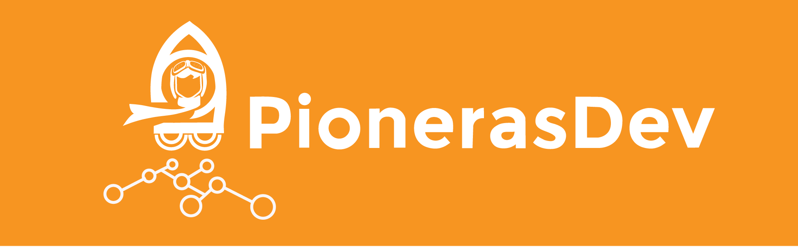
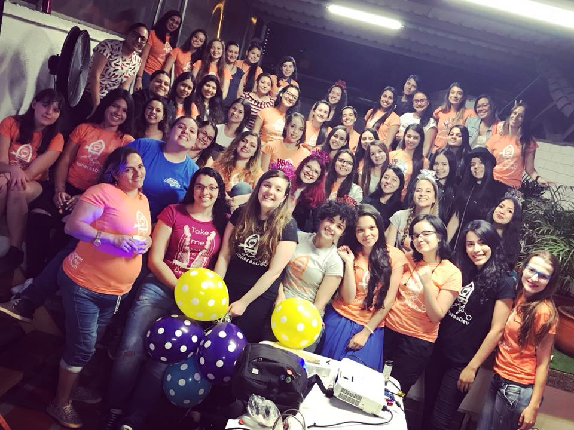

<h2 align="center"> Medellin's largest community for #WomenInTech </h2>

**Hola Mujer :wave:**

Si sabes que es programar, has programado o estás aprendiendo, eres una PIONERA **¡Felicitaciones!:tada:**

Te invitamos a hacer parte de esta comunidad autogestionada, que crecen día a día en todo el mundo, espacios perfectos, para la innovación, experimentación y aprendizaje. Esta comunidad se centra en mujeres para acortar la brecha que existe en el mundo de la tecnología y aumentar nuestra confianza y posibilidades.
¿Sabes que la programación de computadores y la programación Web, es una de las habilidades más importantes que podemos tener en este nuevo siglo?
¡Hay un mundo de posibilidades! podemos crear nuestros propios productos, volver nuestras ideas realidad, impactar el mundo con nuestra visión, y la tecnología es nuestra mejor aliada!
Somos muy pocas y queremos saber quiénes somos, dónde estamos, y cuáles son nuestras historias, para aprender, mejorar y crecer juntas.
Si no sabes que es programar pero amas la tecnología, te apasiona aprender cosas nuevas y retadoras, te gusta tener el poder de crear en tus manos y quieres saber más, tienes el potencial para ser una FUTURA PIONERA.

# Quiero participar! :raising_hand:
Nos reunimos cada dos semanas, realizamos la programación a través de nuestra [página de Meetup](https://www.meetup.com/es/PionerasDevelopers/), recuerda confirmar tu asistencia en la plataforma para saber que contamos contigo.

### Quiero ir, pero soy hombre
¡No te preocupes, puedes sumarte igual!.
La condición: llevar a una mujer contigo que también realice las actividades y dile a ella que también se registre en el meetup!

# PioTalks 2018 :clap:
| Fecha | Titulo | Speaker |
|-------|--------|---------|
| 27/01 | [Primera reunión del año](https://www.meetup.com/es/PionerasDevelopers/events/246816552/) | Core Team PionerasDev |
| 24/02 | [RxJS: Procesos asíncronos con Rick and Morty](https://www.meetup.com/es/PionerasDevelopers/events/247805086/) | [@jdjuan](https://twitter.com/jdjuan) |
| 24/03 | [Juguemos con sql básico y consultas anidadas & React: RGB Generator](https://www.meetup.com/PionerasDevelopers/events/248947656/) | Lorena Correa / [Luisa Vaca](https://twitter.com/otra_gris) |
| 07/04 | [Kubernetes - Certificación con Platzi](https://www.meetup.com/PionerasDevelopers/events/249156604/) | [Catherine Cruz](https://twitter.com/UserTwoGG) / [Diana](https://twitter.com/tifis) |
| 21/04 | Estimación de tareas y proyectos / Como escribir un CFP / App React | [María Paz](https://twitter.com/Pazupersonica) / [Juliana Gómez](https://twitter.com/gmzjuliana) / [Liz Parody](https://twitter.com/lizparody23)|

## Quiero dar una PioTalk!
Queremos escucharte! Cuentanos un poco sobre el tema que nos quieres compartir a través de [este Google Form](https://docs.google.com/forms/d/e/1FAIpQLSckO9gH2iFyB_O1trUo9N5ZaYyaP7lNv1m-DX6Qz4hOxTHBww/viewform)

# Canales Oficiales :computer:
- [Meetup](https://www.meetup.com/es/PionerasDevelopers/)
- [Twitter](https://www.twitter.com/PionerasDev/)
- [Facebook](https://www.facebook.com/pionerasdev/)
- [Instagram](https://www.instagram.com/pionerasdev/)
- [Medium](https://medium.com/@pionerasdev)

# Equipo organizador :two_hearts:

| [ Marian Villa](https://github.com/marianvilla) | [ Camila Gomez](https://github.com/Camigomez35) | [ Manuela Castrillon](https://github.com/ManuCastrillonM) | [ Ana Sosa](https://github.com/anamariasosam)
|:---:|:---:|:---:|:---:|
| [ <b>Juliana Gomez</b>](https://github.com/gomezjuliana) | [ <b>Liz Parody</b>](https://github.com/lizparody) | [ <b>Laura Ciro<b/>](https://github.com/ltciro) | [ <b>Catalina Meneses<b/>](https://github.com/kathcode) |

# Código de conducta :scroll:
Adoptamos el [código de conducta de Colombia Dev](https://github.com/colombia-dev/codigo-de-conducta), si sientes que este está siendo vulnerado o quieres expresarnos alguna situación con la que no te sientas comoda, no dudes en contactarnos, nuestro correo es `pionerasdev@gmail.com`

# Sponsors :open_hands:
